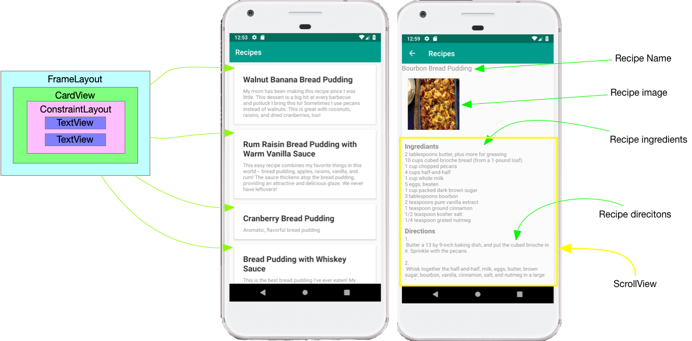

# Assignment 3
## Recipe with RecyclerView 
**RecipeManager** This assignment is based on the 4.5 homework assignment. You will use RecyclerView to present a list of recipe names and descriptions. Clicking on the recipe will start a new Activity or Fragment that shows the detailed recipe with a name and image at the top of the screen, and below that the ingrediants and directions in a scrollVieww.     
    

 

* use the MVC pattern
* the model is the given in both Java and Kotlin in the modle folder
* the main activity **must** use RecyclerView
* the items in the RecyclerViiew should use CardView to display each recipe 
* clicking on a recipe in the RecyclerView should launch a second Activity (or Fragment)
* the detail Acitvity should show the image, the ingediants, and the recipe directions. 
* the ingrdiants and directions should have titles
* the ingrediants and directions should be in a scrollView

The image is given to you by the DataProvider in the from of a URL. On of the easiest ways to work with images in Android is with the Picasso library. Inorder to use the Picasso library you must 

Add the Picasso dependency to your build.gradle (Module: app)  
  	```implementation 'com.squareup.picasso:picasso:2.71828'```   

Add permission to access the internet to your Manifest file 
   ```<uses-permission android:name="android.permission.INTERNET" />``` before the <application> tag

To display the image **recipe.image** with the imageView *imageView*.  

```
 Picasso.get()   
.load(recipe.image)
.fit()
.placeholder(R.drawable.ic_launcher_background)
.error(R.drawable.ic_launcher_background)
.into(imageView);
```
	

* COMMENTS
	* You must have a header comment with your name and the date in every file that you modify
	* Any methods that are not obvious must have comments
	* identifier names, variables, classes, functions, must be descriptive and meaningful
	* Any method that is more than 15 lines long must have comments (hint, if you make your methods shorter you don't need comments)

